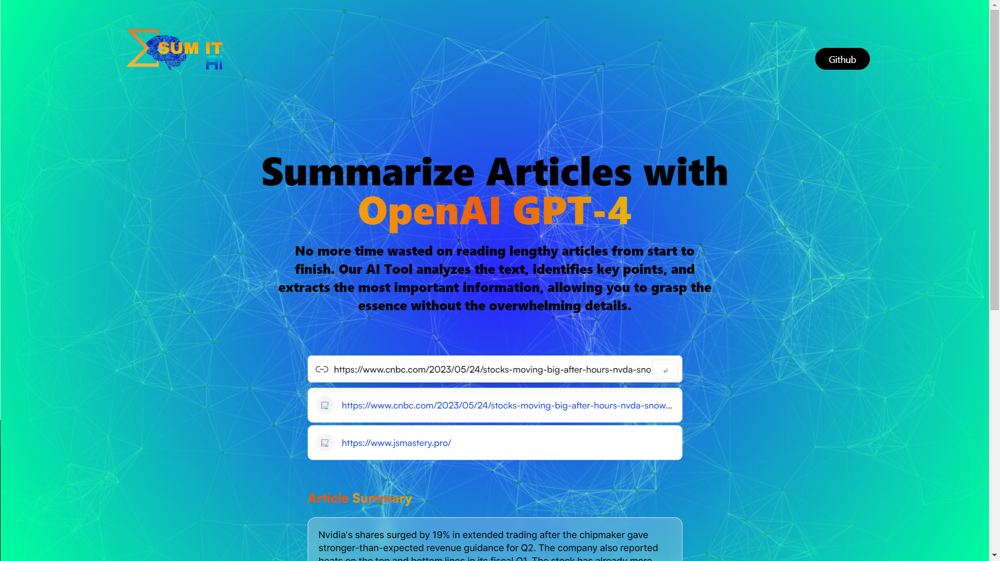

# Article Summarizer

## Overview

Article Summarizer is a web application that utilizes the power of the OpenAI API to generate concise summaries of any article. With this tool, users can quickly extract the key points and main ideas from lengthy texts, saving time and enhancing comprehension.

The application provides a user-friendly interface where users can input the article or provide a URL to fetch the content. It then sends the article to the OpenAI API for processing and retrieves the generated summary. The summary is displayed to the user, allowing them to access the important information without reading the entire article.

## Features

- Simple and intuitive user interface.
- Support for both article text and URL inputs.
- Integration with the OpenAI API for text summarization.
- Generated summaries that capture the essence of the article.
- Responsive design for optimal user experience on various devices.

## Technologies Used

-HTML
-Tailwind CSS
-JavaScript
-React.js
-Redux Toolkit
-OpenAI API

## License

This project is licensed under the MIT License.

## Acknowledgements
This project was inspired by the need for efficient article summarization.
Special thanks to OpenAI for their powerful language processing capabilities.

## Contributing
Contributions are welcome! If you'd like to contribute to this project, please fork the repository and submit a pull request. Feel free to open an issue if you encounter any bugs or have suggestions for improvements.
