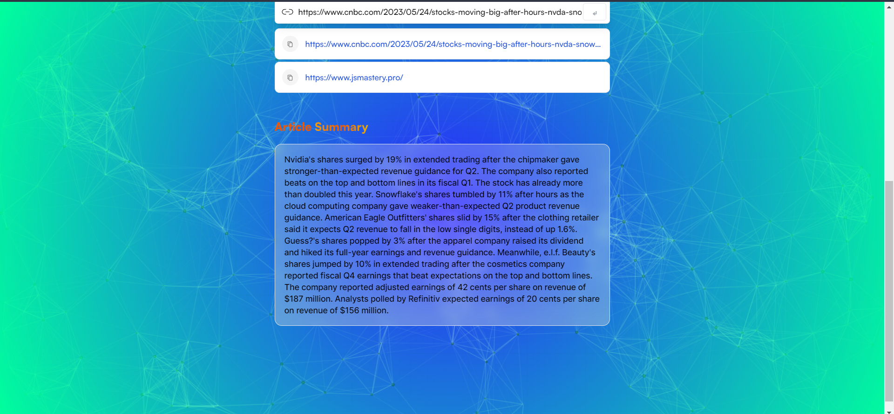

# Article Summarizer Using AI 🤖

Article Summarizer is a web application that utilizes the power of the [OpenAI](https://openai.com/) API to generate concise summaries of any article. With this tool, users can quickly extract the key points and main ideas from lengthy texts, saving time and enhancing comprehension.

The application provides a user-friendly interface where users can input the article or provide a URL to fetch the content. It then sends the article to the OpenAI API for processing and retrieves the generated summary. The summary is displayed to the user, allowing them to access the important information without reading the entire article.

## Screenshots 📜

## Features 🪶

* Simple and intuitive user interface.
* Support for both article text and URL inputs.
* Integration with the OpenAI API for text summarization.
* Generated summaries that capture the essence of the article.
* Responsive design for optimal user experience on various devices.

## Technologies Used ⚙️

* **HTML** - HTML (HyperText Markup Language) is the most basic building block of the Web. It defines the meaning and structure of web content. HTML uses “markup” to annotate text, images, and other content for display in a Web browser
* **Tailwind CSS** - Tailwind CSS is a utility-first CSS framework that provides a set of pre-defined CSS classes for styling HTML elements. It allows developers to quickly build custom designs by combining these classes in their HTML.
* **JavaScript** - JavaScript is a high-level programming language commonly used for web development. It enables developers to add interactivity and dynamic behavior to web pages.
* **React.js** - React.js is a popular JavaScript library for building user interfaces. It allows developers to create reusable UI components and manage the state of their application.
* **Redux Toolkit** - Redux Toolkit is a package that helps developers to write Redux logic more easily. It provides a set of tools and utilities for managing application state and reducing boilerplate code.
* **OpenAI API** - The [OpenAI API](https://openai.com/blog/openai-api) provides access to powerful language processing capabilities. It can be used to generate human-like text, summarize articles, translate languages, and more.

## Acknowledgements 🙏
This project was inspired by the need for efficient article summarization.
Special thanks to OpenAI for their powerful language processing capabilities.
We would also like to thank the open-source community for providing the tools and resources that helped us build this application.

## Contributing 😊
Contributions are always welcome! If you’d like to contribute to this project, please fork the repository and submit a pull request. Feel free to open an issue if you encounter any bugs or have suggestions for improvements.

### If you liked the project, please ⭐ the repo. It encourages me a lot!
